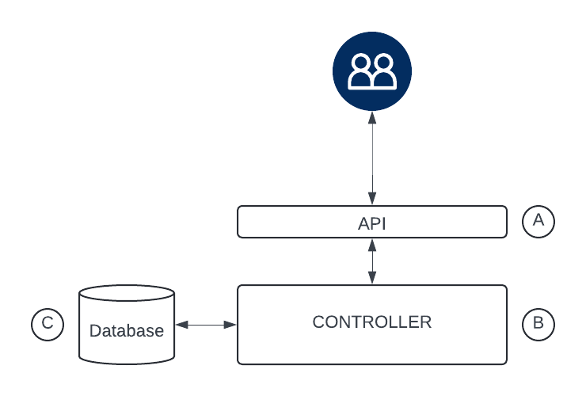

# NLP Suggestion Service

## Goal

The objective of this application is to create an ML-based system that provides positive text suggestions to end-users. Users can input an English sentence with a blank or missing part, and the system will return suggestions that positively fill in the blank.

### Examples

- **Input**: have a `<blank>` day  
  **Output**: good, excellent, amazing
- **Input**: the application was `<blank>`  
  **Output**: well designed, so pretty, the best I’ve ever seen

## Design

### First Approach (Proof of Concept)

- **Throughput**: Low  
- **Scalability**: None (Demonstration only)



#### Components

- **API Layer (A)**: Handles communication with users via GET/POST requests and interacts with the controller.
- **Controller Layer (B)**: Manages requests, saves them in the database, and performs predictions using the ML inference pipeline.
- **Database (C)**: Stores request information for auditing purposes.

### API

The API layer implements three key functionalities:

- **POST Endpoint**: Submits a request with a phrase to be filled in. This creates a new request containing the sentence and associated client.
- **GET Endpoint**: Retrieves request details based on the provided request ID.
- **Search Endpoint**: Allows for paginated search of requests in the database, with filters for status, client, start date, and end date.

#### Authentication

Authentication is handled using JWT tokens via a custom `JWTBearer` class, which extends `HTTPBearer`. This class decodes and validates the JWT, ensuring the token's scheme, validity, and expiration. If authentication fails, an HTTP 403 error is raised. Configuration details such as the JWT secret and algorithm are stored in `APIConfig`.

#### Data Models

- **Sentence Model**: Validates that a string sentence contains a `<blank>` placeholder, has between 1 and 10 words, consists of English characters, and excludes special characters (except allowed ones like ,, ., !, ?, `<`, and `>`).
- **NLPRequest Model**: A Pydantic model representing the request payload with fields for sentence and client.
- **NLPModel**: Represents the request payload with metadata such as id, status, requested_at, updated, and results.
- **SearchQuery**: A Pydantic class containing search payloads like status, date_from, date_to, and client.

### Controller

The Controller Layer handles requests and implements the application's business logic.

- **Abstract Controller**: Defines common functionalities like request retrieval, search, and database operations.
- **Base Controller**: Extends the AbstractController and implements the PoC logic, following a synchronous pattern where a request is created and the ML pipeline generates the results.

### Database

The service uses a PostgreSQL database to monitor requests and store results. Alembic migrations ensure data integrity.

### ML Pipeline

The ML component performs two primary tasks:

- Filling in blanks within a given sentence using positive words.
- Filtering results to retain only positive suggestions.

This pipeline leverages pre-trained models from Hugging Face and follows these steps:

- **Preprocessing**: Cleans the input sentence by filtering symbols and formatting appropriately.
- **Fill-in Prediction**: Uses the model to predict suitable words for the blanks.
- **Sentiment Analysis**: Filters the results to retain only those with positive sentiment.


### GitHub Actions

The GitHub Actions workflow includes three main jobs:

- **Linters**: Security checks and code style analysis using tools like Bandit, detect-secrets, flake8, refurb, and hadolint.
- **Tests**: Runs unit and functional tests with Python 3.10, using Poetry and PostgreSQL.
- **Docker Build**: Builds a Docker image using Buildx with caching enabled.


### API Documentation

Swagger is used for API documentation, providing an interactive interface for users to explore and test the endpoints.


### Client

A client was created to simplify interactions with the service. This client automates request creation, handles authentication by generating JWT tokens, and provides methods to create and retrieve requests. By using this client, users can easily interact with the service without worrying about manual token generation or complex request handling.

## Optimization

### Service Performance

To optimize throughput and performance, an asynchronous architecture similar to a web-worker model is proposed. The controller handles incoming API requests by storing them in a database and generating messages for a queue. The worker-consumer processes these messages through the ML pipeline and updates the database with results.

Scalability is managed based on queue depth. For example:

- Queue length up to 10: Two workers are initiated.
- Queue length up to 50: Ten workers are started.


To achieve this:

- Modify the request payload to handle batches of sentences.
- Ensure the model supports batch predictions.
- Refactor the controller to produce messages for the queue.
- Implement a pub/sub package in the project.
- Create a worker to act as a consumer.
- Split dependencies between web and worker in Poetry.
- Implement multi-stage building in the Dockerfile.

### Model Performance

To optimize model performance:

- Monitor inference execution time and memory consumption.
- Track model versions using a tool like DVC.
- Enhance model loading and performance with ONNX.
- Monitor model performance and detect data drift using EvidentlyAI.

## Using the Application

1. Clone the repository from GitHub using the main branch.
2. Run the Docker Compose file by typing `docker-compose up`. Wait a few minutes for the services to start.
3. Interact with the service using either:
   - The playground script (includes a client that interacts with the service).
   - The Swagger documentation page.
4. For authentication, create a JWT token using "test" as the secret key (as specified in Swagger). However, it is recommended to use the client, which automatically generates the token, avoiding manual token creation.

```python
from client.data_model import NLPRequest
from client.factories import create_client

client = create_client(
    base_url="http://0.0.0.0:8000/",
    jwt_secret="test"
)

job = NLPRequest(sentence='have a <blank> day', client='ioanna')
response = client.create_request(job)
print(response)
```